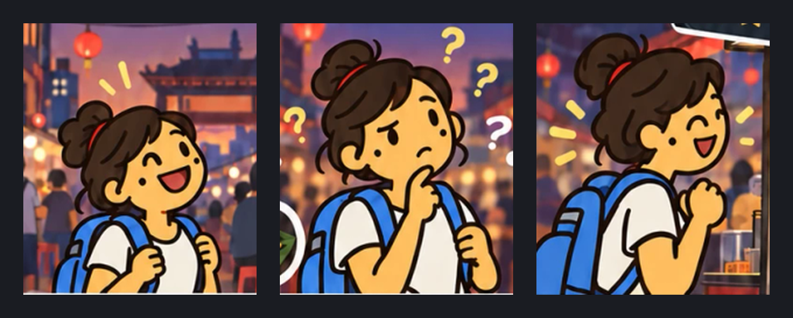

# Implementation - Brand Characters

## Purpose

The character set owns what the BiteTribe tribe is, where the artwork lives, and
how a character SVG was produced.

It exists because the set was created as raster renders in a local design folder,
where nothing recorded which variants were current or that they were derived from
the logo rather than drawn beside it.

[Implementation - Store Listing Assets](store-listing-assets.md) owns the store identity and the listing
artwork. This page owns the character artwork itself.

Filed as
[issue #1482][#1482].

## The Set

Every character is the same bitten cookie wearing a different piece of cultural
headwear. **The shipped logo is one of them, not the mark the others were derived
from** - it wears a feathered headdress - which is why the Storybook showcase
renders it in the line-up rather than above it.

| Character | File                                                                               | Headwear                  |
| --------- | ---------------------------------------------------------------------------------- | ------------------------- |
| BiteTribe | `apps/bite-tribe/src/assets/icons/logo.svg`                                        | feathered headdress       |
| Viking    | [`ssot/assets/characters/01-viking.svg`](../assets/characters/01-viking.svg)       | horned helmet             |
| Arab      | [`ssot/assets/characters/02-arab.svg`](../assets/characters/02-arab.svg)           | keffiyeh and agal         |
| Ethiopian | [`ssot/assets/characters/03-ethiopian.svg`](../assets/characters/03-ethiopian.svg) | striped headband          |
| Turk      | [`ssot/assets/characters/04-turk.svg`](../assets/characters/04-turk.svg)           | fez                       |
| Chinese   | [`ssot/assets/characters/05-chinese.svg`](../assets/characters/05-chinese.svg)     | hair buns                 |
| Japanese  | [`ssot/assets/characters/06-japanese.svg`](../assets/characters/06-japanese.svg)   | kabuto                    |
| Swiss     | [`ssot/assets/characters/07-swiss.svg`](../assets/characters/07-swiss.svg)         | alpine hat with edelweiss |

The names are the design export's and mix a historical term with national ones.
A product vocabulary has not been decided, so nothing in the repository should
treat these as user-facing labels. See [Current State - Open Questions](../current-state/open-questions.md).

### The Logo Is In An Older Palette

The set is not yet colour-consistent, and the Storybook page is where that shows.

| Role    | Logo      | The seven |
| ------- | --------- | --------- |
| Outline | `#55422A` | `#402810` |
| Cookie  | `#F0B967` | `#F8B850` |
| Shade   | `#CE8B3D` | `#C88028` |

The seven carry a darker outline over a more saturated cookie. Whether the logo
is re-cut to match or the set is pulled back toward the logo is a brand decision
that has not been taken, and it is the reason the logo is rendered beside them
rather than trusted as the reference.

## Leela

**Leela is the main character BiteTribe is building toward.** She is not one of
the tribe above: she is a person, not a cookie, and she is the traveller the
tribe exists for. Named 26 September 2026.

She first appears, unnamed, as the traveller in
[The Street Food Comic Post](social-media-channels.md#the-street-food-comic-post),
and she acts out the tagline there: she arrives at a night market, cannot
choose, finds the Pad Thai somebody rated five stars, and shares her own Bite
of it. That is the role she carries forward - the person who uses the app,
where the tribe is the brand around it.

### Reference Artwork

Cut from the published comic, because the comic's source file is not in the
repo. Each crop is a `200x233` region of
`ssot/assets/social/street-food-comic-post.png`, scaled 2x with Lanczos to
`400x466`.

| File                                                                                | Panel | Expression             | Source box (x0, y0, x1, y1) |
| ----------------------------------------------------------------------------------- | ----- | ---------------------- | --------------------------- |
| [`leela-arrives.png`](../assets/characters/leela/leela-arrives.png)                 | 1     | excited, eyes shut     | `400, 32, 600, 265`         |
| [`leela-cant-choose.png`](../assets/characters/leela/leela-cant-choose.png)         | 2     | puzzled, hand to chin  | `420, 275, 620, 508`        |
| [`leela-gets-the-dish.png`](../assets/characters/leela/leela-gets-the-dish.png)     | 4     | delighted, fist up     | `310, 785, 510, 1018`       |
| [`leela-reference-sheet.png`](../assets/characters/leela/leela-reference-sheet.png) | -     | all three on `#1A1C22` | -                           |

Panels 3 and 5 show her from behind, over the shoulder, and are not cut.

**These are references, not production artwork.** Each crop still carries the
market painted behind her, and the framed post is already a downscale of a
`941x1672` original. Unlike the tribe, she cannot be traced the way
[How A Character SVG Was Produced](#how-a-character-svg-was-produced) describes:
the method needs a flat render on a plain canvas, and the comic has none. A
clean Leela - isolated, on a transparent canvas, in more poses - needs a new
design pass that uses these crops as the brief.

### What Makes Her Leela

The traits a redraw has to keep, read from the three panels:

- **Hair**: dark brown, shoulder length and wavy, pulled up into a messy top bun
  with loose strands, tied with a red band.
- **Face**: round, with dot eyes that close into arcs when she laughs, a small
  beauty mark under her left eye (viewer's right), and a wide open-mouthed grin.
- **Clothes**: plain white T-shirt; a blue backpack with both straps on, which is
  what makes her a traveller in every panel.
- **Line**: thick near-black outline, flat fills, no rendering - the same flat
  style as the tribe.

| Role     | Colour    |
| -------- | --------- |
| Skin     | `#F6C569` |
| Hair     | `#40291C` |
| Band     | `#A9352A` |
| Shirt    | `#F3ECDE` |
| Backpack | `#387FE1` |
| Outline  | `#1D0F08` |

The values are medians sampled from the comic, so they carry its compression and
lighting; a redraw should settle them rather than copy them. Her skin sits within
a few units of the tribe's `#F8B850` cookie, which is worth keeping on purpose -
she reads as part of the family.

Where she appears in the product, if anywhere, is open. See
[Current State - Open Questions](../current-state/open-questions.md).

## Where The Artwork Lives

The characters are versioned under `ssot/assets/characters/`, beside the
store-listing and social assets, **not** in an app's asset folder.

This is deliberate and depends on a fact that is true today: nothing in the
product references a character. Angular's asset glob copies a whole assets
folder into every build, so placing them next to `logo.svg` would ship roughly
320 KB into all three apps to serve nothing.

**When a surface actually uses a character, the file moves to
`apps/bite-tribe/src/assets/` and this page is updated.** Do not copy it - two
copies of brand artwork drift.

The logo is the exception already: it ships, because the apps render it.

## How A Character SVG Was Produced

The committed SVGs are **traced from the approved renders, not re-drawn**. The
design pass produced 1254x1254 raster images; those pixels are the approved
artwork, so a hand-rebuilt vector would have been a new design wearing the same
description.

Method, in the order it has to run:

1. Denoise the render with a 3x3 median filter and posterise each channel to
   5 bits. The renders carry compression noise, which otherwise becomes hundreds
   of near-identical colours and, after tracing, thousands of path segments.
2. Cluster the colours **in CIE L\*a\*b\***, seeding a cluster from the most
   frequent colour that is at least 10 CIE76 units from every seed taken so far.
3. Flood-fill the canvas colour inward from the four corners and drop it, so the
   background is transparent while an interior white - a keffiyeh, a horn, a hat
   band - survives as a filled shape.
4. Trace each colour as its own layer with
   `potrace --svg -a 1.3 -O 0.8 -t 16 -u 10`, largest area first, the outline
   colour last.
5. Grow every layer below the outline by one pixel, so smoothing cannot open a
   seam between two adjacent fills.
6. Optimise with `svgo`, keeping `viewBox` and one decimal of precision.

### Two Rules That Are Not Obvious

**Cluster in Lab, not RGB.** RGB distance collapses dark hues: the Swiss hat's
dark green and the outline brown are 61 units apart in RGB, close enough to merge
at any threshold loose enough to absorb compression noise. The hat came out
brown. In Lab the same pair is far apart while the noise is not.

**Seed clusters by frequency, not by volume.** Median-cut quantisation allocates
buckets by how much of the image a colour covers, so it spends its buckets on the
cookie and drops the small saturated details - the Ethiopian headband's green and
red stripes, the red in the Swiss hat band - into their neighbours. Frequency
seeding with a perceptual separation keeps a colour that covers 0.07% of the
image if no similar colour has been taken.

### Fidelity

Each SVG was rendered back to 1254x1254 and compared to its source render:
mean per-channel difference is 2-3 of 255, and fewer than 0.6% of pixels differ
by more than 60. That residue is antialiased raster edges becoming crisp vector
edges, which is the intended difference.

Repeat the check before replacing a character, rather than reviewing the SVG by
eye - a merged colour looks like a design choice at thumbnail size.

**The tracing script is not in this repository.** It is Python, depends on
`potrace` and Pillow, and `tools/` is Node. It lives with the design source. The
parameters above are the reproducible part; a re-run needs the script recovered
or rewritten from them.

## What The Files Contain

Real vector paths, one group per flat colour, on a transparent 1254x1254 canvas.

An earlier export wrapped the raster in an `<image>` element inside an `<svg>`
wrapper. Those files are 1.5 MB each, do not scale, and are **not** what is
committed here. If a character ever grows past ~100 KB, check for an embedded
raster before accepting it.

## Storybook

`apps/storybook-host/src/app/characters/characters.stories.ts` renders the whole
set on one page, as `Brand/Characters`.

Storybook reaches the artwork through a third `staticDirs` entry in
`apps/storybook-host/.storybook/main.ts`, mapping `ssot/assets/characters/` to
`/assets/characters/`. The logo comes from the app assets entry that already
exists.

This is the only consumer of the SSOT folder, and it is a documentation surface
rather than a shipped one, which is what makes serving SSOT material from it
acceptable.

Loki captures the page like any other story, so a character that fails to load
fails the visual job rather than rendering as a silent gap - `fetchFailIgnore` in
`loki.config.js` ignores third-party hosts only. See [Implementation - Storybook](storybook.md).

[#1482]: https://github.com/muhammedgaygisiz/travellers-apps/issues/1482
